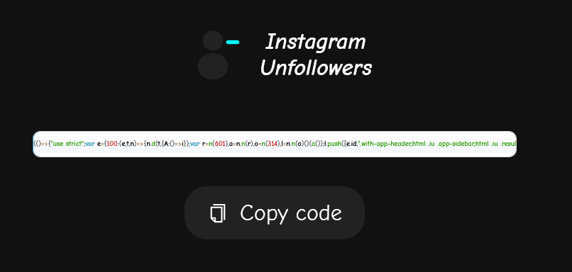
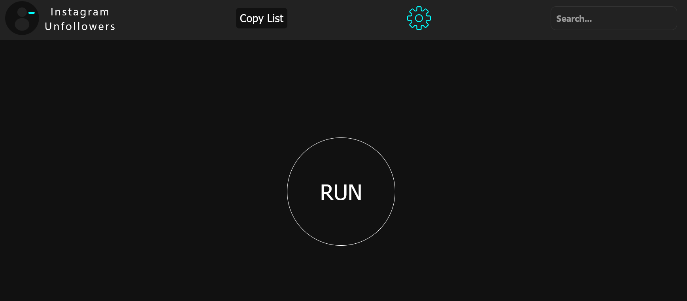
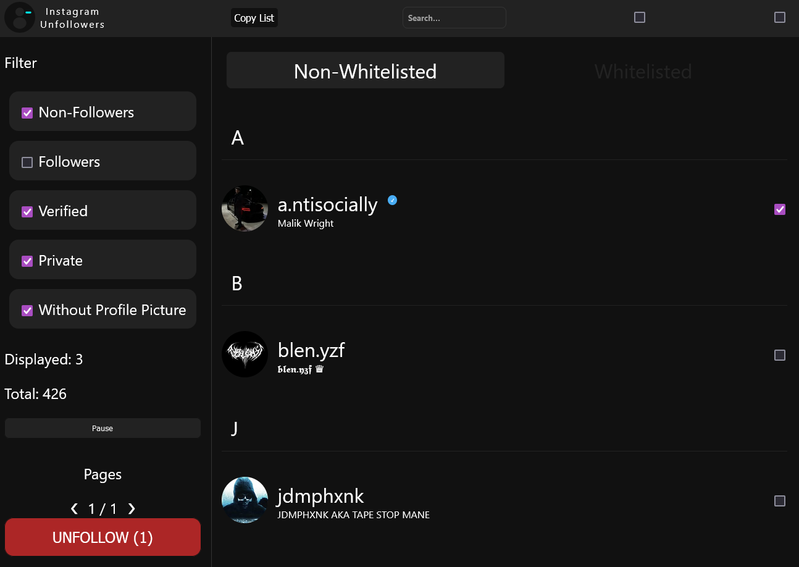
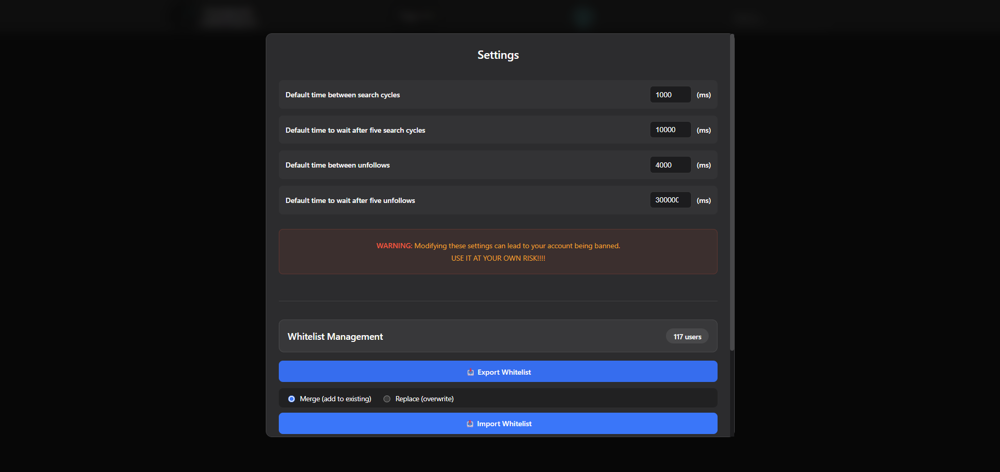

# Instagram Unfollowers

A nifty tool that lets you see who doesn't follow you back on Instagram.  
<u>Browser-based and requires no downloads or installations!</u>

## **WARNING**

This version utilizes the Instagram API for better performance.  

## Usage

### Steps:

1.  Copy the following code from this url. (This has been moved to this site, because the repository was taking too long to load with so many characters.The web site only shows the compiled and minified code. )

### https://davidarroyo1234.github.io/InstagramUnfollowers/

2. Press the COPY button to copy the code.

    

3. Once you have copied the code, you can close this page and go to the instagram website

4. Log in into your account and open the developer console or (Ctrl+Shift+J(Windows) || ⌘+⌥+I (Mac os)) and paste the code.

5. You will be met with the following interface:

 

6. Click "RUN" to start scanning for users who do not follow you back.

7. Once it finishes printing the users, you will be met with the following screen which will show you the results:

 

8. To add some user to the whitelist, click in the profile image of the user. This will add the user to the whitelist and will not show up in the results anymore.

9. If you wish to un-follow any of these users, you can select 1 or more of them via the checkbox next to each user.

10. With the latest version, you can now tweak and customize the timings of the script. You can do this by clicking on the "Settings" button.

 

## Notes

**_The more users you have to check, more time it will take_**

**_The latest version of the script runs both on chromium and firefox based browsers_**

## DEV

Node version: 16.14.0 (If using nvm use the comand "nvm use")
When introducing new changes to `main.tsx`, make sure to run the "build" command in-order to automatically format, compress, and convert your code. (In the future will be automatic).

## Legal

**Disclaimer:** This is not affiliated, associated, authorized, endorsed by, or in any way officially connected with Instagram.

Use it at your own risk!.
