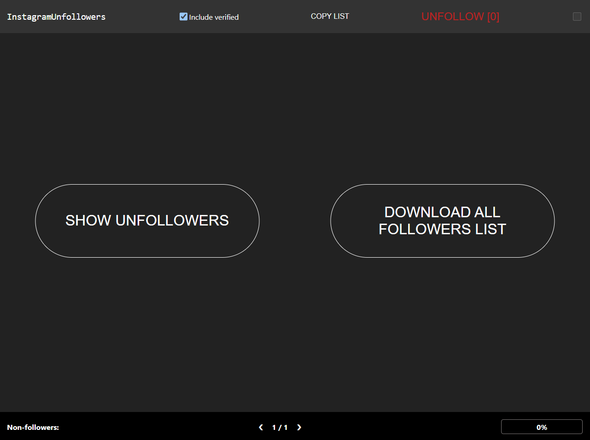

# Instagram Unfollowers

[](https://github.com/davidarroyo1234/InstagramUnfollowers)

A nifty tool that lets you see who doesn't follow you back on Instagram.  
<u>Browser-based and requires no downloads or installations!</u>

## **WARNING**

This version utilizes the Instagram API for better performance.  
If you prefer to use the older version please use this [commit](https://github.com/davidarroyo1234/InstagramUnfollowers/tree/50a0bcbc9fe349b8664a74c0e4477bc974d0352b).

## Usage

### Steps:

1.  Copy the following code

```js
(()=>{"use strict";var e={99:(e,t,n)=>{n.d(t,{Z:()=>i});var r=n(81),o=n.n(r),l=n(645),a=n.n(l)()(o());a.push([e.id,".main-layout,html .iu .app-header-content,html .iu{width:100%;max-width:1300px;margin:0 auto}.with-app-header,html .iu .results-container,html .iu .unfollow-log-container,html .iu .app-sidebar{padding-top:4rem !important}.flex,html .iu .tabs-container,html .iu .results-container .result-item,html .iu .app-sidebar,html .iu .app-header-content,html .iu .app-header{display:flex}.flex.align-center,html .iu .align-center.tabs-container,html .iu .results-container .result-item,html .iu .align-center.app-sidebar,html .iu .app-header-content,html .iu .align-center.app-header{align-items:center}.flex.justify-center,html .iu .justify-center.tabs-container,html .iu .results-container .justify-center.result-item,html .iu .justify-center.app-sidebar,html .iu .justify-center.app-header-content,html .iu .justify-center.app-header{justify-content:center}.flex.column,html .iu .column.tabs-container,html .iu .results-container .column.result-item,html .iu .app-sidebar,html .iu .column.app-header-content,html .iu .column.app-header{flex-direction:column}.grow,html .iu .tabs-container .tab,html .iu .results-container,html .iu .unfollow-log-container{flex:1}.w-100{width:100%}.p-small,html .iu .tabs-container .tab,html .iu .results-container .result-item .private-indicator{padding:.5rem}.p-medium,html .iu .badge,html .iu button.unfollow,html .iu .unfollow-log-container,html .iu .results-container .result-item,html .iu .results-container .alphabet-character,html .iu .app-sidebar{padding:1rem}.p-large,html .iu .tabs-container{padding:1.5rem}.p-xlarge,html .iu .toast{padding:2rem}.p-clear,html .iu button{padding:0}.m-small{margin:.5rem}.m-medium,html .iu .results-container .alphabet-character{margin:1rem}.m-large{margin:1.5rem}.m-xlarge{margin:2rem}.m-clear{margin:0}.fs-small{font-size:.5rem}.fs-medium,html .iu button.copy-list{font-size:1rem}.fs-large,html .iu button.unfollow,html .iu .app-sidebar,html .iu .app-header .logo{font-size:1.5rem}.fs-xlarge,html .iu .tabs-container .tab,html .iu .results-container .alphabet-character{font-size:2rem}.clr-inherit,html .iu button.unfollow{color:inherit}.clr-red{color:#ac2626}.clr-green{color:#56d756}.clr-cyan{color:aqua}.d-none,html .iu .results-container .result-item .avatar-container .avatar-icon-overlay-container{display:none}.t-center,html .iu .tabs-container .tab{text-align:center}.pos-relative,html .iu .results-container .result-item .avatar-container{position:relative}*{box-sizing:border-box}html{background-color:#111 !important}html body{margin:0}html .iu{font-family:system-ui}html .iu .overlay{color:#fff}html .iu .app-header{position:fixed;top:0;left:0;right:0;height:4rem;background-color:#222;z-index:1}html .iu .app-header-content{padding:0 1rem;justify-content:space-between}html .iu .app-header .logo{font-family:monospace;cursor:pointer}html .iu .app-header .search-bar{color:#fff;border-radius:8px;padding:.5rem;font-weight:bold;font-family:inherit;background-color:rgba(0,0,0,0);border:1px solid #444}html .iu .app-sidebar{position:sticky;top:0;overflow:auto;height:100vh;min-width:300px;border-inline-end:1px solid #333}html .iu label{cursor:pointer}html .iu input[type=checkbox]{height:1.1rem;width:1.1rem}html .iu a{color:inherit;text-decoration-color:rgba(0,0,0,0);transition:text-decoration-color .1s;cursor:pointer}html .iu a:hover{text-decoration-color:inherit}html .iu button{background:none;border:none;cursor:pointer}html .iu button.copy-list{color:#fff}html .iu button.run-scan{position:absolute;left:50%;top:50%;transform:translate(-50%, -50%);font-size:2em;color:#fff;border:1px solid #fff;height:160px;width:160px;border-radius:50%}html .iu button.unfollow{margin-bottom:1.5rem;background-color:#ac2626 !important}html .iu .progressbar{width:100%;height:5px;position:absolute}html .iu .results-container .alphabet-character{border-bottom:1px solid #222}html .iu .results-container .result-item{border-radius:3px;cursor:pointer}html .iu .results-container .result-item .avatar-container:hover .avatar{filter:brightness(0.25) blur(3px)}html .iu .results-container .result-item .avatar-container:hover .avatar-icon-overlay-container{display:inline-block}html .iu .results-container .result-item .avatar-container .avatar{width:75px;border-radius:50%}html .iu .results-container .result-item .avatar-container .avatar-icon-overlay-container{position:absolute;top:50%;left:50%;transform:translate(-50%, -50%)}html .iu .results-container .result-item .verified-badge{background-color:#49adf4;border-radius:50%;padding:.2rem .3rem;font-size:.45em;height:fit-content;transform:translateY(-15px)}html .iu .results-container .result-item .private-indicator{border:2px solid #51bb42;border-radius:25px;color:#51bb42;font-weight:500}html .iu .tabs-container .tab{color:gray;border-radius:8px;cursor:pointer}html .iu .tabs-container .tab-active{color:inherit;background-color:#222}html .iu .toast{position:fixed;bottom:1rem;left:1rem;color:#000;background-color:#fff;border-radius:6px;font-size:1.25em;z-index:2}html .iu .badge,html .iu button.unfollow{background:#222;border-radius:15px}",""]);const i=a},645:e=>{e.exports=function(e){var t=[];return t.toString=function(){return this.map((function(t){var n="",r=void 0!==t[5];return t[4]&&(n+="@supports (".concat(t[4],") {")),t[2]&&(n+="@media ".concat(t[2]," {")),r&&(n+="@layer".concat(t[5].length>0?" ".concat(t[5]):""," {")),n+=e(t),r&&(n+="}"),t[2]&&(n+="}"),t[4]&&(n+="}"),n})).join("")},t.i=function(e,n,r,o,l){"string"==typeof e&&(e=[[null,e,void 0]]);var a={};if(r)for(var i=0;i<this.length;i++){var u=this[i][0];null!=u&&(a[u]=!0)}for(var c=0;c<e.length;c++){var s=[].concat(e[c]);r&&a[s[0]]||(void 0!==l&&(void 0===s[5]||(s[1]="@layer".concat(s[5].length>0?" ".concat(s[5]):""," {").concat(s[1],"}")),s[5]=l),n&&(s[2]?(s[1]="@media ".concat(s[2]," {").concat(s[1],"}"),s[2]=n):s[2]=n),o&&(s[4]?(s[1]="@supports (".concat(s[4],") {").concat(s[1],"}"),s[4]=o):s[4]="".concat(o)),t.push(s))}},t}},81:e=>{e.exports=function(e){return e[1]}},776:(e,t,n)=>{n.r(t),n.d(t,{Children:()=>Te,Component:()=>b,Fragment:()=>v,PureComponent:()=>ke,StrictMode:()=>st,Suspense:()=>Me,SuspenseList:()=>Ie,__SECRET_INTERNALS_DO_NOT_USE_OR_YOU_WILL_BE_FIRED:()=>tt,cloneElement:()=>lt,createContext:()=>j,createElement:()=>h,createFactory:()=>rt,createPortal:()=>je,createRef:()=>m,default:()=>mt,findDOMNode:()=>it,flushSync:()=>ct,forwardRef:()=>Ce,hydrate:()=>$e,isValidElement:()=>ot,lazy:()=>Fe,memo:()=>Ee,render:()=>Be,startTransition:()=>ft,unmountComponentAtNode:()=>at,unstable_batchedUpdates:()=>ut,useCallback:()=>ie,useContext:()=>ue,useDebugValue:()=>ce,useDeferredValue:()=>_t,useEffect:()=>ne,useErrorBoundary:()=>se,useId:()=>fe,useImperativeHandle:()=>le,useInsertionEffect:()=>ht,useLayoutEffect:()=>re,useMemo:()=>ae,useReducer:()=>te,useRef:()=>oe,useState:()=>ee,useSyncExternalStore:()=>pt,useTransition:()=>dt,version:()=>nt});var r,o,l,a,i,u,c={},s=[],f=/acit|ex(?:s|g|n|p|$)|rph|grid|ows|mnc|ntw|ine[ch]|zoo|^ord|itera/i;function _(e,t){for(var n in t)e[n]=t[n];return e}function d(e){var t=e.parentNode;t&&t.removeChild(e)}function h(e,t,n){var o,l,a,i={};for(a in t)"key"==a?o=t[a]:"ref"==a?l=t[a]:i[a]=t[a];if(arguments.length>2&&(i.children=arguments.length>3?r.call(arguments,2):n),"function"==typeof e&&null!=e.defaultProps)for(a in e.defaultProps)void 0===i[a]&&(i[a]=e.defaultProps[a]);return p(e,i,o,l,null)}function p(e,t,n,r,a){var i={type:e,props:t,key:n,ref:r,__k:null,__:null,__b:0,__e:null,__d:void 0,__c:null,__h:null,constructor:void 0,__v:null==a?++l:a};return null==a&&null!=o.vnode&&o.vnode(i),i}function m(){return{current:null}}function v(e){return e.children}function b(e,t){this.props=e,this.context=t}function g(e,t){if(null==t)return e.__?g(e.__,e.__.__k.indexOf(e)+1):null;for(var n;t<e.__k.length;t++)if(null!=(n=e.__k[t])&&null!=n.__e)return n.__e;return"function"==typeof e.type?g(e):null}function y(e){var t,n;if(null!=(e=e.__)&&null!=e.__c){for(e.__e=e.__c.base=null,t=0;t<e.__k.length;t++)if(null!=(n=e.__k[t])&&null!=n.__e){e.__e=e.__c.base=n.__e;break}return y(e)}}function w(e){(!e.__d&&(e.__d=!0)&&a.push(e)&&!k.__r++||i!==o.debounceRendering)&&((i=o.debounceRendering)||setTimeout)(k)}function k(){for(var e;k.__r=a.length;)e=a.sort((function(e,t){return e.__v.__b-t.__v.__b})),a=[],e.some((function(e){var t,n,r,o,l,a;e.__d&&(l=(o=(t=e).__v).__e,(a=t.__P)&&(n=[],(r=_({},o)).__v=o.__v+1,P(a,o,r,t.__n,void 0!==a.ownerSVGElement,null!=o.__h?[l]:null,n,null==l?g(o):l,o.__h),O(n,o),o.__e!=l&&y(o)))}))}function E(e,t,n,r,o,l,a,i,u,f){var _,d,h,m,b,y,w,k=r&&r.__k||s,E=k.length;for(n.__k=[],_=0;_<t.length;_++)if(null!=(m=n.__k[_]=null==(m=t[_])||"boolean"==typeof m?null:"string"==typeof m||"number"==typeof m||"bigint"==typeof m?p(null,m,null,null,m):Array.isArray(m)?p(v,{children:m},null,null,null):m.__b>0?p(m.type,m.props,m.key,m.ref?m.ref:null,m.__v):m)){if(m.__=n,m.__b=n.__b+1,null===(h=k[_])||h&&m.key==h.key&&m.type===h.type)k[_]=void 0;else for(d=0;d<E;d++){if((h=k[d])&&m.key==h.key&&m.type===h.type){k[d]=void 0;break}h=null}P(e,m,h=h||c,o,l,a,i,u,f),b=m.__e,(d=m.ref)&&h.ref!=d&&(w||(w=[]),h.ref&&w.push(h.ref,null,m),w.push(d,m.__c||b,m)),null!=b?(null==y&&(y=b),"function"==typeof m.type&&m.__k===h.__k?m.__d=u=x(m,u,e):u=C(e,m,h,k,b,u),"function"==typeof n.type&&(n.__d=u)):u&&h.__e==u&&u.parentNode!=e&&(u=g(h))}for(n.__e=y,_=E;_--;)null!=k[_]&&F(k[_],k[_]);if(w)for(_=0;_<w.length;_++)L(w[_],w[++_],w[++_])}function x(e,t,n){for(var r,o=e.__k,l=0;o&&l<o.length;l++)(r=o[l])&&(r.__=e,t="function"==typeof r.type?x(r,t,n):C(n,r,r,o,r.__e,t));return t}function N(e,t){return t=t||[],null==e||"boolean"==typeof e||(Array.isArray(e)?e.some((function(e){N(e,t)})):t.push(e)),t}function C(e,t,n,r,o,l){var a,i,u;if(void 0!==t.__d)a=t.__d,t.__d=void 0;else if(null==n||o!=l||null==o.parentNode)e:if(null==l||l.parentNode!==e)e.appendChild(o),a=null;else{for(i=l,u=0;(i=i.nextSibling)&&u<r.length;u+=1)if(i==o)break e;e.insertBefore(o,l),a=l}return void 0!==a?a:o.nextSibling}function S(e,t,n){"-"===t[0]?e.setProperty(t,n):e[t]=null==n?"":"number"!=typeof n||f.test(t)?n:n+"px"}function T(e,t,n,r,o){var l;e:if("style"===t)if("string"==typeof n)e.style.cssText=n;else{if("string"==typeof r&&(e.style.cssText=r=""),r)for(t in r)n&&t in n||S(e.style,t,"");if(n)for(t in n)r&&n[t]===r[t]||S(e.style,t,n[t])}else if("o"===t[0]&&"n"===t[1])l=t!==(t=t.replace(/Capture$/,"")),t=t.toLowerCase()in e?t.toLowerCase().slice(2):t.slice(2),e.l||(e.l={}),e.l[t+l]=n,n?r||e.addEventListener(t,l?R:U,l):e.removeEventListener(t,l?R:U,l);else if("dangerouslySetInnerHTML"!==t){if(o)t=t.replace(/xlink(H|:h)/,"h").replace(/sName$/,"s");else if("href"!==t&&"list"!==t&&"form"!==t&&"tabIndex"!==t&&"download"!==t&&t in e)try{e[t]=null==n?"":n;break e}catch(e){}"function"==typeof n||(null==n||!1===n&&-1==t.indexOf("-")?e.removeAttribute(t):e.setAttribute(t,n))}}function U(e){this.l[e.type+!1](o.event?o.event(e):e)}function R(e){this.l[e.type+!0](o.event?o.event(e):e)}function P(e,t,n,r,l,a,i,u,c){var s,f,d,h,p,m,g,y,w,k,x,N,C,S,T,U=t.type;if(void 0!==t.constructor)return null;null!=n.__h&&(c=n.__h,u=t.__e=n.__e,t.__h=null,a=[u]),(s=o.__b)&&s(t);try{e:if("function"==typeof U){if(y=t.props,w=(s=U.contextType)&&r[s.__c],k=s?w?w.props.value:s.__:r,n.__c?g=(f=t.__c=n.__c).__=f.__E:("prototype"in U&&U.prototype.render?t.__c=f=new U(y,k):(t.__c=f=new b(y,k),f.constructor=U,f.render=I),w&&w.sub(f),f.props=y,f.state||(f.state={}),f.context=k,f.__n=r,d=f.__d=!0,f.__h=[],f._sb=[]),null==f.__s&&(f.__s=f.state),null!=U.getDerivedStateFromProps&&(f.__s==f.state&&(f.__s=_({},f.__s)),_(f.__s,U.getDerivedStateFromProps(y,f.__s))),h=f.props,p=f.state,d)null==U.getDerivedStateFromProps&&null!=f.componentWillMount&&f.componentWillMount(),null!=f.componentDidMount&&f.__h.push(f.componentDidMount);else{if(null==U.getDerivedStateFromProps&&y!==h&&null!=f.componentWillReceiveProps&&f.componentWillReceiveProps(y,k),!f.__e&&null!=f.shouldComponentUpdate&&!1===f.shouldComponentUpdate(y,f.__s,k)||t.__v===n.__v){for(f.props=y,f.state=f.__s,t.__v!==n.__v&&(f.__d=!1),f.__v=t,t.__e=n.__e,t.__k=n.__k,t.__k.forEach((function(e){e&&(e.__=t)})),x=0;x<f._sb.length;x++)f.__h.push(f._sb[x]);f._sb=[],f.__h.length&&i.push(f);break e}null!=f.componentWillUpdate&&f.componentWillUpdate(y,f.__s,k),null!=f.componentDidUpdate&&f.__h.push((function(){f.componentDidUpdate(h,p,m)}))}if(f.context=k,f.props=y,f.__v=t,f.__P=e,N=o.__r,C=0,"prototype"in U&&U.prototype.render){for(f.state=f.__s,f.__d=!1,N&&N(t),s=f.render(f.props,f.state,f.context),S=0;S<f._sb.length;S++)f.__h.push(f._sb[S]);f._sb=[]}else do{f.__d=!1,N&&N(t),s=f.render(f.props,f.state,f.context),f.state=f.__s}while(f.__d&&++C<25);f.state=f.__s,null!=f.getChildContext&&(r=_(_({},r),f.getChildContext())),d||null==f.getSnapshotBeforeUpdate||(m=f.getSnapshotBeforeUpdate(h,p)),T=null!=s&&s.type===v&&null==s.key?s.props.children:s,E(e,Array.isArray(T)?T:[T],t,n,r,l,a,i,u,c),f.base=t.__e,t.__h=null,f.__h.length&&i.push(f),g&&(f.__E=f.__=null),f.__e=!1}else null==a&&t.__v===n.__v?(t.__k=n.__k,t.__e=n.__e):t.__e=M(n.__e,t,n,r,l,a,i,c);(s=o.diffed)&&s(t)}catch(e){t.__v=null,(c||null!=a)&&(t.__e=u,t.__h=!!c,a[a.indexOf(u)]=null),o.__e(e,t,n)}}function O(e,t){o.__c&&o.__c(t,e),e.some((function(t){try{e=t.__h,t.__h=[],e.some((function(e){e.call(t)}))}catch(e){o.__e(e,t.__v)}}))}function M(e,t,n,o,l,a,i,u){var s,f,_,h=n.props,p=t.props,m=t.type,v=0;if("svg"===m&&(l=!0),null!=a)for(;v<a.length;v++)if((s=a[v])&&"setAttribute"in s==!!m&&(m?s.localName===m:3===s.nodeType)){e=s,a[v]=null;break}if(null==e){if(null===m)return document.createTextNode(p);e=l?document.createElementNS("http://www.w3.org/2000/svg",m):document.createElement(m,p.is&&p),a=null,u=!1}if(null===m)h===p||u&&e.data===p||(e.data=p);else{if(a=a&&r.call(e.childNodes),f=(h=n.props||c).dangerouslySetInnerHTML,_=p.dangerouslySetInnerHTML,!u){if(null!=a)for(h={},v=0;v<e.attributes.length;v++)h[e.attributes[v].name]=e.attributes[v].value;(_||f)&&(_&&(f&&_.__html==f.__html||_.__html===e.innerHTML)||(e.innerHTML=_&&_.__html||""))}if(function(e,t,n,r,o){var l;for(l in n)"children"===l||"key"===l||l in t||T(e,l,null,n[l],r);for(l in t)o&&"function"!=typeof t[l]||"children"===l||"key"===l||"value"===l||"checked"===l||n[l]===t[l]||T(e,l,t[l],n[l],r)}(e,p,h,l,u),_)t.__k=[];else if(v=t.props.children,E(e,Array.isArray(v)?v:[v],t,n,o,l&&"foreignObject"!==m,a,i,a?a[0]:n.__k&&g(n,0),u),null!=a)for(v=a.length;v--;)null!=a[v]&&d(a[v]);u||("value"in p&&void 0!==(v=p.value)&&(v!==e.value||"progress"===m&&!v||"option"===m&&v!==h.value)&&T(e,"value",v,h.value,!1),"checked"in p&&void 0!==(v=p.checked)&&v!==e.checked&&T(e,"checked",v,h.checked,!1))}return e}function L(e,t,n){try{"function"==typeof e?e(t):e.current=t}catch(e){o.__e(e,n)}}function F(e,t,n){var r,l;if(o.unmount&&o.unmount(e),(r=e.ref)&&(r.current&&r.current!==e.__e||L(r,null,t)),null!=(r=e.__c)){if(r.componentWillUnmount)try{r.componentWillUnmount()}catch(e){o.__e(e,t)}r.base=r.__P=null,e.__c=void 0}if(r=e.__k)for(l=0;l<r.length;l++)r[l]&&F(r[l],t,n||"function"!=typeof e.type);n||null==e.__e||d(e.__e),e.__=e.__e=e.__d=void 0}function I(e,t,n){return this.constructor(e,n)}function A(e,t,n){var l,a,i;o.__&&o.__(e,t),a=(l="function"==typeof n)?null:n&&n.__k||t.__k,i=[],P(t,e=(!l&&n||t).__k=h(v,null,[e]),a||c,c,void 0!==t.ownerSVGElement,!l&&n?[n]:a?null:t.firstChild?r.call(t.childNodes):null,i,!l&&n?n:a?a.__e:t.firstChild,l),O(i,e)}function D(e,t){A(e,t,D)}function H(e,t,n){var o,l,a,i=_({},e.props);for(a in t)"key"==a?o=t[a]:"ref"==a?l=t[a]:i[a]=t[a];return arguments.length>2&&(i.children=arguments.length>3?r.call(arguments,2):n),p(e.type,i,o||e.key,l||e.ref,null)}function j(e,t){var n={__c:t="__cC"+u++,__:e,Consumer:function(e,t){return e.children(t)},Provider:function(e){var n,r;return this.getChildContext||(n=[],(r={})[t]=this,this.getChildContext=function(){return r},this.shouldComponentUpdate=function(e){this.props.value!==e.value&&n.some(w)},this.sub=function(e){n.push(e);var t=e.componentWillUnmount;e.componentWillUnmount=function(){n.splice(n.indexOf(e),1),t&&t.call(e)}}),e.children}};return n.Provider.__=n.Consumer.contextType=n}r=s.slice,o={__e:function(e,t,n,r){for(var o,l,a;t=t.__;)if((o=t.__c)&&!o.__)try{if((l=o.constructor)&&null!=l.getDerivedStateFromError&&(o.setState(l.getDerivedStateFromError(e)),a=o.__d),null!=o.componentDidCatch&&(o.componentDidCatch(e,r||{}),a=o.__d),a)return o.__E=o}catch(t){e=t}throw e}},l=0,b.prototype.setState=function(e,t){var n;n=null!=this.__s&&this.__s!==this.state?this.__s:this.__s=_({},this.state),"function"==typeof e&&(e=e(_({},n),this.props)),e&&_(n,e),null!=e&&this.__v&&(t&&this._sb.push(t),w(this))},b.prototype.forceUpdate=function(e){this.__v&&(this.__e=!0,e&&this.__h.push(e),w(this))},b.prototype.render=v,a=[],k.__r=0,u=0;var V,W,z,q,B=0,$=[],G=[],Z=o.__b,Y=o.__r,J=o.diffed,K=o.__c,Q=o.unmount;function X(e,t){o.__h&&o.__h(W,e,B||t),B=0;var n=W.__H||(W.__H={__:[],__h:[]});return e>=n.__.length&&n.__.push({__V:G}),n.__[e]}function ee(e){return B=1,te(be,e)}function te(e,t,n){var r=X(V++,2);if(r.t=e,!r.__c&&(r.__=[n?n(t):be(void 0,t),function(e){var t=r.__N?r.__N[0]:r.__[0],n=r.t(t,e);t!==n&&(r.__N=[n,r.__[1]],r.__c.setState({}))}],r.__c=W,!W.u)){W.u=!0;var o=W.shouldComponentUpdate;W.shouldComponentUpdate=function(e,t,n){if(!r.__c.__H)return!0;var l=r.__c.__H.__.filter((function(e){return e.__c}));if(l.every((function(e){return!e.__N})))return!o||o.call(this,e,t,n);var a=!1;return l.forEach((function(e){if(e.__N){var t=e.__[0];e.__=e.__N,e.__N=void 0,t!==e.__[0]&&(a=!0)}})),!(!a&&r.__c.props===e)&&(!o||o.call(this,e,t,n))}}return r.__N||r.__}function ne(e,t){var n=X(V++,3);!o.__s&&ve(n.__H,t)&&(n.__=e,n.i=t,W.__H.__h.push(n))}function re(e,t){var n=X(V++,4);!o.__s&&ve(n.__H,t)&&(n.__=e,n.i=t,W.__h.push(n))}function oe(e){return B=5,ae((function(){return{current:e}}),[])}function le(e,t,n){B=6,re((function(){return"function"==typeof e?(e(t()),function(){return e(null)}):e?(e.current=t(),function(){return e.current=null}):void 0}),null==n?n:n.concat(e))}function ae(e,t){var n=X(V++,7);return ve(n.__H,t)?(n.__V=e(),n.i=t,n.__h=e,n.__V):n.__}function ie(e,t){return B=8,ae((function(){return e}),t)}function ue(e){var t=W.context[e.__c],n=X(V++,9);return n.c=e,t?(null==n.__&&(n.__=!0,t.sub(W)),t.props.value):e.__}function ce(e,t){o.useDebugValue&&o.useDebugValue(t?t(e):e)}function se(e){var t=X(V++,10),n=ee();return t.__=e,W.componentDidCatch||(W.componentDidCatch=function(e,r){t.__&&t.__(e,r),n[1](e)}),[n[0],function(){n[1](void 0)}]}function fe(){var e=X(V++,11);if(!e.__){for(var t=W.__v;null!==t&&!t.__m&&null!==t.__;)t=t.__;var n=t.__m||(t.__m=[0,0]);e.__="P"+n[0]+"-"+n[1]++}return e.__}function _e(){for(var e;e=$.shift();)if(e.__P&&e.__H)try{e.__H.__h.forEach(pe),e.__H.__h.forEach(me),e.__H.__h=[]}catch(t){e.__H.__h=[],o.__e(t,e.__v)}}o.__b=function(e){W=null,Z&&Z(e)},o.__r=function(e){Y&&Y(e),V=0;var t=(W=e.__c).__H;t&&(z===W?(t.__h=[],W.__h=[],t.__.forEach((function(e){e.__N&&(e.__=e.__N),e.__V=G,e.__N=e.i=void 0}))):(t.__h.forEach(pe),t.__h.forEach(me),t.__h=[])),z=W},o.diffed=function(e){J&&J(e);var t=e.__c;t&&t.__H&&(t.__H.__h.length&&(1!==$.push(t)&&q===o.requestAnimationFrame||((q=o.requestAnimationFrame)||he)(_e)),t.__H.__.forEach((function(e){e.i&&(e.__H=e.i),e.__V!==G&&(e.__=e.__V),e.i=void 0,e.__V=G}))),z=W=null},o.__c=function(e,t){t.some((function(e){try{e.__h.forEach(pe),e.__h=e.__h.filter((function(e){return!e.__||me(e)}))}catch(n){t.some((function(e){e.__h&&(e.__h=[])})),t=[],o.__e(n,e.__v)}})),K&&K(e,t)},o.unmount=function(e){Q&&Q(e);var t,n=e.__c;n&&n.__H&&(n.__H.__.forEach((function(e){try{pe(e)}catch(e){t=e}})),n.__H=void 0,t&&o.__e(t,n.__v))};var de="function"==typeof requestAnimationFrame;function he(e){var t,n=function(){clearTimeout(r),de&&cancelAnimationFrame(t),setTimeout(e)},r=setTimeout(n,100);de&&(t=requestAnimationFrame(n))}function pe(e){var t=W,n=e.__c;"function"==typeof n&&(e.__c=void 0,n()),W=t}function me(e){var t=W;e.__c=e.__(),W=t}function ve(e,t){return!e||e.length!==t.length||t.some((function(t,n){return t!==e[n]}))}function be(e,t){return"function"==typeof t?t(e):t}function ge(e,t){for(var n in t)e[n]=t[n];return e}function ye(e,t){for(var n in e)if("__source"!==n&&!(n in t))return!0;for(var r in t)if("__source"!==r&&e[r]!==t[r])return!0;return!1}function we(e,t){return e===t&&(0!==e||1/e==1/t)||e!=e&&t!=t}function ke(e){this.props=e}function Ee(e,t){function n(e){var n=this.props.ref,r=n==e.ref;return!r&&n&&(n.call?n(null):n.current=null),t?!t(this.props,e)||!r:ye(this.props,e)}function r(t){return this.shouldComponentUpdate=n,h(e,t)}return r.displayName="Memo("+(e.displayName||e.name)+")",r.prototype.isReactComponent=!0,r.__f=!0,r}(ke.prototype=new b).isPureReactComponent=!0,ke.prototype.shouldComponentUpdate=function(e,t){return ye(this.props,e)||ye(this.state,t)};var xe=o.__b;o.__b=function(e){e.type&&e.type.__f&&e.ref&&(e.props.ref=e.ref,e.ref=null),xe&&xe(e)};var Ne="undefined"!=typeof Symbol&&Symbol.for&&Symbol.for("react.forward_ref")||3911;function Ce(e){function t(t){var n=ge({},t);return delete n.ref,e(n,t.ref||null)}return t.$$typeof=Ne,t.render=t,t.prototype.isReactComponent=t.__f=!0,t.displayName="ForwardRef("+(e.displayName||e.name)+")",t}var Se=function(e,t){return null==e?null:N(N(e).map(t))},Te={map:Se,forEach:Se,count:function(e){return e?N(e).length:0},only:function(e){var t=N(e);if(1!==t.length)throw"Children.only";return t[0]},toArray:N},Ue=o.__e;o.__e=function(e,t,n,r){if(e.then)for(var o,l=t;l=l.__;)if((o=l.__c)&&o.__c)return null==t.__e&&(t.__e=n.__e,t.__k=n.__k),o.__c(e,t);Ue(e,t,n,r)};var Re=o.unmount;function Pe(e,t,n){return e&&(e.__c&&e.__c.__H&&(e.__c.__H.__.forEach((function(e){"function"==typeof e.__c&&e.__c()})),e.__c.__H=null),null!=(e=ge({},e)).__c&&(e.__c.__P===n&&(e.__c.__P=t),e.__c=null),e.__k=e.__k&&e.__k.map((function(e){return Pe(e,t,n)}))),e}function Oe(e,t,n){return e&&(e.__v=null,e.__k=e.__k&&e.__k.map((function(e){return Oe(e,t,n)})),e.__c&&e.__c.__P===t&&(e.__e&&n.insertBefore(e.__e,e.__d),e.__c.__e=!0,e.__c.__P=n)),e}function Me(){this.__u=0,this.t=null,this.__b=null}function Le(e){var t=e.__.__c;return t&&t.__a&&t.__a(e)}function Fe(e){var t,n,r;function o(o){if(t||(t=e()).then((function(e){n=e.default||e}),(function(e){r=e})),r)throw r;if(!n)throw t;return h(n,o)}return o.displayName="Lazy",o.__f=!0,o}function Ie(){this.u=null,this.o=null}o.unmount=function(e){var t=e.__c;t&&t.__R&&t.__R(),t&&!0===e.__h&&(e.type=null),Re&&Re(e)},(Me.prototype=new b).__c=function(e,t){var n=t.__c,r=this;null==r.t&&(r.t=[]),r.t.push(n);var o=Le(r.__v),l=!1,a=function(){l||(l=!0,n.__R=null,o?o(i):i())};n.__R=a;var i=function(){if(!--r.__u){if(r.state.__a){var e=r.state.__a;r.__v.__k[0]=Oe(e,e.__c.__P,e.__c.__O)}var t;for(r.setState({__a:r.__b=null});t=r.t.pop();)t.forceUpdate()}},u=!0===t.__h;r.__u++||u||r.setState({__a:r.__b=r.__v.__k[0]}),e.then(a,a)},Me.prototype.componentWillUnmount=function(){this.t=[]},Me.prototype.render=function(e,t){if(this.__b){if(this.__v.__k){var n=document.createElement("div"),r=this.__v.__k[0].__c;this.__v.__k[0]=Pe(this.__b,n,r.__O=r.__P)}this.__b=null}var o=t.__a&&h(v,null,e.fallback);return o&&(o.__h=null),[h(v,null,t.__a?null:e.children),o]};var Ae=function(e,t,n){if(++n[1]===n[0]&&e.o.delete(t),e.props.revealOrder&&("t"!==e.props.revealOrder[0]||!e.o.size))for(n=e.u;n;){for(;n.length>3;)n.pop()();if(n[1]<n[0])break;e.u=n=n[2]}};function De(e){return this.getChildContext=function(){return e.context},e.children}function He(e){var t=this,n=e.i;t.componentWillUnmount=function(){A(null,t.l),t.l=null,t.i=null},t.i&&t.i!==n&&t.componentWillUnmount(),e.__v?(t.l||(t.i=n,t.l={nodeType:1,parentNode:n,childNodes:[],appendChild:function(e){this.childNodes.push(e),t.i.appendChild(e)},insertBefore:function(e,n){this.childNodes.push(e),t.i.appendChild(e)},removeChild:function(e){this.childNodes.splice(this.childNodes.indexOf(e)>>>1,1),t.i.removeChild(e)}}),A(h(De,{context:t.context},e.__v),t.l)):t.l&&t.componentWillUnmount()}function je(e,t){var n=h(He,{__v:e,i:t});return n.containerInfo=t,n}(Ie.prototype=new b).__a=function(e){var t=this,n=Le(t.__v),r=t.o.get(e);return r[0]++,function(o){var l=function(){t.props.revealOrder?(r.push(o),Ae(t,e,r)):o()};n?n(l):l()}},Ie.prototype.render=function(e){this.u=null,this.o=new Map;var t=N(e.children);e.revealOrder&&"b"===e.revealOrder[0]&&t.reverse();for(var n=t.length;n--;)this.o.set(t[n],this.u=[1,0,this.u]);return e.children},Ie.prototype.componentDidUpdate=Ie.prototype.componentDidMount=function(){var e=this;this.o.forEach((function(t,n){Ae(e,n,t)}))};var Ve="undefined"!=typeof Symbol&&Symbol.for&&Symbol.for("react.element")||60103,We=/^(?:accent|alignment|arabic|baseline|cap|clip(?!PathU)|color|dominant|fill|flood|font|glyph(?!R)|horiz|image|letter|lighting|marker(?!H|W|U)|overline|paint|pointer|shape|stop|strikethrough|stroke|text(?!L)|transform|underline|unicode|units|v|vector|vert|word|writing|x(?!C))[A-Z]/,ze="undefined"!=typeof document,qe=function(e){return("undefined"!=typeof Symbol&&"symbol"==typeof Symbol()?/fil|che|rad/i:/fil|che|ra/i).test(e)};function Be(e,t,n){return null==t.__k&&(t.textContent=""),A(e,t),"function"==typeof n&&n(),e?e.__c:null}function $e(e,t,n){return D(e,t),"function"==typeof n&&n(),e?e.__c:null}b.prototype.isReactComponent={},["componentWillMount","componentWillReceiveProps","componentWillUpdate"].forEach((function(e){Object.defineProperty(b.prototype,e,{configurable:!0,get:function(){return this["UNSAFE_"+e]},set:function(t){Object.defineProperty(this,e,{configurable:!0,writable:!0,value:t})}})}));var Ge=o.event;function Ze(){}function Ye(){return this.cancelBubble}function Je(){return this.defaultPrevented}o.event=function(e){return Ge&&(e=Ge(e)),e.persist=Ze,e.isPropagationStopped=Ye,e.isDefaultPrevented=Je,e.nativeEvent=e};var Ke,Qe={configurable:!0,get:function(){return this.class}},Xe=o.vnode;o.vnode=function(e){var t=e.type,n=e.props,r=n;if("string"==typeof t){var o=-1===t.indexOf("-");for(var l in r={},n){var a=n[l];ze&&"children"===l&&"noscript"===t||"value"===l&&"defaultValue"in n&&null==a||("defaultValue"===l&&"value"in n&&null==n.value?l="value":"download"===l&&!0===a?a="":/ondoubleclick/i.test(l)?l="ondblclick":/^onchange(textarea|input)/i.test(l+t)&&!qe(n.type)?l="oninput":/^onfocus$/i.test(l)?l="onfocusin":/^onblur$/i.test(l)?l="onfocusout":/^on(Ani|Tra|Tou|BeforeInp|Compo)/.test(l)?l=l.toLowerCase():o&&We.test(l)?l=l.replace(/[A-Z0-9]/g,"-$&").toLowerCase():null===a&&(a=void 0),/^oninput$/i.test(l)&&(l=l.toLowerCase(),r[l]&&(l="oninputCapture")),r[l]=a)}"select"==t&&r.multiple&&Array.isArray(r.value)&&(r.value=N(n.children).forEach((function(e){e.props.selected=-1!=r.value.indexOf(e.props.value)}))),"select"==t&&null!=r.defaultValue&&(r.value=N(n.children).forEach((function(e){e.props.selected=r.multiple?-1!=r.defaultValue.indexOf(e.props.value):r.defaultValue==e.props.value}))),e.props=r,n.class!=n.className&&(Qe.enumerable="className"in n,null!=n.className&&(r.class=n.className),Object.defineProperty(r,"className",Qe))}e.$$typeof=Ve,Xe&&Xe(e)};var et=o.__r;o.__r=function(e){et&&et(e),Ke=e.__c};var tt={ReactCurrentDispatcher:{current:{readContext:function(e){return Ke.__n[e.__c].props.value}}}},nt="17.0.2";function rt(e){return h.bind(null,e)}function ot(e){return!!e&&e.$$typeof===Ve}function lt(e){return ot(e)?H.apply(null,arguments):e}function at(e){return!!e.__k&&(A(null,e),!0)}function it(e){return e&&(e.base||1===e.nodeType&&e)||null}var ut=function(e,t){return e(t)},ct=function(e,t){return e(t)},st=v;function ft(e){e()}function _t(e){return e}function dt(){return[!1,ft]}var ht=re;function pt(e,t){var n=t(),r=ee({h:{__:n,v:t}}),o=r[0].h,l=r[1];return re((function(){o.__=n,o.v=t,we(o.__,t())||l({h:o})}),[e,n,t]),ne((function(){return we(o.__,o.v())||l({h:o}),e((function(){we(o.__,o.v())||l({h:o})}))}),[e]),n}var mt={useState:ee,useId:fe,useReducer:te,useEffect:ne,useLayoutEffect:re,useInsertionEffect:re,useTransition:dt,useDeferredValue:_t,useSyncExternalStore:pt,startTransition:ft,useRef:oe,useImperativeHandle:le,useMemo:ae,useCallback:ie,useContext:ue,useDebugValue:ce,version:"17.0.2",Children:Te,render:Be,hydrate:$e,unmountComponentAtNode:at,createPortal:je,createElement:h,createContext:j,createFactory:rt,cloneElement:lt,createRef:m,Fragment:v,isValidElement:ot,findDOMNode:it,Component:b,PureComponent:ke,memo:Ee,forwardRef:Ce,flushSync:ct,unstable_batchedUpdates:ut,StrictMode:v,Suspense:Me,SuspenseList:Ie,lazy:Fe,__SECRET_INTERNALS_DO_NOT_USE_OR_YOU_WILL_BE_FIRED:tt}},273:(e,t,n)=>{n.r(t),n.d(t,{default:()=>v});var r=n(379),o=n.n(r),l=n(795),a=n.n(l),i=n(569),u=n.n(i),c=n(565),s=n.n(c),f=n(216),_=n.n(f),d=n(589),h=n.n(d),p=n(99),m={};m.styleTagTransform=h(),m.setAttributes=s(),m.insert=u().bind(null,"head"),m.domAPI=a(),m.insertStyleElement=_(),o()(p.Z,m);const v=p.Z&&p.Z.locals?p.Z.locals:void 0},379:e=>{var t=[];function n(e){for(var n=-1,r=0;r<t.length;r++)if(t[r].identifier===e){n=r;break}return n}function r(e,r){for(var l={},a=[],i=0;i<e.length;i++){var u=e[i],c=r.base?u[0]+r.base:u[0],s=l[c]||0,f="".concat(c," ").concat(s);l[c]=s+1;var _=n(f),d={css:u[1],media:u[2],sourceMap:u[3],supports:u[4],layer:u[5]};if(-1!==_)t[_].references++,t[_].updater(d);else{var h=o(d,r);r.byIndex=i,t.splice(i,0,{identifier:f,updater:h,references:1})}a.push(f)}return a}function o(e,t){var n=t.domAPI(t);return n.update(e),function(t){if(t){if(t.css===e.css&&t.media===e.media&&t.sourceMap===e.sourceMap&&t.supports===e.supports&&t.layer===e.layer)return;n.update(e=t)}else n.remove()}}e.exports=function(e,o){var l=r(e=e||[],o=o||{});return function(e){e=e||[];for(var a=0;a<l.length;a++){var i=n(l[a]);t[i].references--}for(var u=r(e,o),c=0;c<l.length;c++){var s=n(l[c]);0===t[s].references&&(t[s].updater(),t.splice(s,1))}l=u}}},569:e=>{var t={};e.exports=function(e,n){var r=function(e){if(void 0===t[e]){var n=document.querySelector(e);if(window.HTMLIFrameElement&&n instanceof window.HTMLIFrameElement)try{n=n.contentDocument.head}catch(e){n=null}t[e]=n}return t[e]}(e);if(!r)throw new Error("Couldn't find a style target. This probably means that the value for the 'insert' parameter is invalid.");r.appendChild(n)}},216:e=>{e.exports=function(e){var t=document.createElement("style");return e.setAttributes(t,e.attributes),e.insert(t,e.options),t}},565:(e,t,n)=>{e.exports=function(e){var t=n.nc;t&&e.setAttribute("nonce",t)}},795:e=>{e.exports=function(e){var t=e.insertStyleElement(e);return{update:function(n){!function(e,t,n){var r="";n.supports&&(r+="@supports (".concat(n.supports,") {")),n.media&&(r+="@media ".concat(n.media," {"));var o=void 0!==n.layer;o&&(r+="@layer".concat(n.layer.length>0?" ".concat(n.layer):""," {")),r+=n.css,o&&(r+="}"),n.media&&(r+="}"),n.supports&&(r+="}");var l=n.sourceMap;l&&"undefined"!=typeof btoa&&(r+="\n/*# sourceMappingURL=data:application/json;base64,".concat(btoa(unescape(encodeURIComponent(JSON.stringify(l))))," */")),t.styleTagTransform(r,e,t.options)}(t,e,n)},remove:function(){!function(e){if(null===e.parentNode)return!1;e.parentNode.removeChild(e)}(t)}}}},589:e=>{e.exports=function(e,t){if(t.styleSheet)t.styleSheet.cssText=e;else{for(;t.firstChild;)t.removeChild(t.firstChild);t.appendChild(document.createTextNode(e))}}},629:function(e,t,n){var r=this&&this.__importDefault||function(e){return e&&e.__esModule?e:{default:e}};Object.defineProperty(t,"__esModule",{value:!0}),t.UserCheckIcon=void 0;var o=r(n(776));t.UserCheckIcon=function(){return o.default.createElement("svg",{width:"35",height:"35",viewBox:"0 0 24 24",fill:"none",stroke:"currentColor",strokeWidth:"2",strokeLinecap:"round",strokeLinejoin:"round"},o.default.createElement("path",{d:"M16 21v-2a4 4 0 0 0-4-4H5a4 4 0 0 0-4 4v2"}),o.default.createElement("circle",{cx:"8.5",cy:"7",r:"4"}),o.default.createElement("polyline",{points:"17 11 19 13 23 9"}))}},460:function(e,t,n){var r=this&&this.__importDefault||function(e){return e&&e.__esModule?e:{default:e}};Object.defineProperty(t,"__esModule",{value:!0}),t.UserUncheckIcon=void 0;var o=r(n(776));t.UserUncheckIcon=function(){return o.default.createElement("svg",{width:"35",height:"35",viewBox:"0 0 24 24",fill:"none",stroke:"currentColor",strokeWidth:"2",strokeLinecap:"round",strokeLinejoin:"round"},o.default.createElement("path",{d:"M16 21v-2a4 4 0 0 0-4-4H5a4 4 0 0 0-4 4v2"}),o.default.createElement("circle",{cx:"8.5",cy:"7",r:"4"}),o.default.createElement("line",{x1:"18",y1:"8",x2:"23",y2:"13"}),o.default.createElement("line",{x1:"23",y1:"8",x2:"18",y2:"13"}))}},299:function(e,t,n){var r=this&&this.__assign||function(){return r=Object.assign||function(e){for(var t,n=1,r=arguments.length;n<r;n++)for(var o in t=arguments[n])Object.prototype.hasOwnProperty.call(t,o)&&(e[o]=t[o]);return e},r.apply(this,arguments)},o=this&&this.__createBinding||(Object.create?function(e,t,n,r){void 0===r&&(r=n);var o=Object.getOwnPropertyDescriptor(t,n);o&&!("get"in o?!t.__esModule:o.writable||o.configurable)||(o={enumerable:!0,get:function(){return t[n]}}),Object.defineProperty(e,r,o)}:function(e,t,n,r){void 0===r&&(r=n),e[r]=t[n]}),l=this&&this.__setModuleDefault||(Object.create?function(e,t){Object.defineProperty(e,"default",{enumerable:!0,value:t})}:function(e,t){e.default=t}),a=this&&this.__importStar||function(e){if(e&&e.__esModule)return e;var t={};if(null!=e)for(var n in e)"default"!==n&&Object.prototype.hasOwnProperty.call(e,n)&&o(t,e,n);return l(t,e),t},i=this&&this.__awaiter||function(e,t,n,r){return new(n||(n=Promise))((function(o,l){function a(e){try{u(r.next(e))}catch(e){l(e)}}function i(e){try{u(r.throw(e))}catch(e){l(e)}}function u(e){var t;e.done?o(e.value):(t=e.value,t instanceof n?t:new n((function(e){e(t)}))).then(a,i)}u((r=r.apply(e,t||[])).next())}))},u=this&&this.__generator||function(e,t){var n,r,o,l,a={label:0,sent:function(){if(1&o[0])throw o[1];return o[1]},trys:[],ops:[]};return l={next:i(0),throw:i(1),return:i(2)},"function"==typeof Symbol&&(l[Symbol.iterator]=function(){return this}),l;function i(i){return function(u){return function(i){if(n)throw new TypeError("Generator is already executing.");for(;l&&(l=0,i[0]&&(a=0)),a;)try{if(n=1,r&&(o=2&i[0]?r.return:i[0]?r.throw||((o=r.return)&&o.call(r),0):r.next)&&!(o=o.call(r,i[1])).done)return o;switch(r=0,o&&(i=[2&i[0],o.value]),i[0]){case 0:case 1:o=i;break;case 4:return a.label++,{value:i[1],done:!1};case 5:a.label++,r=i[1],i=[0];continue;case 7:i=a.ops.pop(),a.trys.pop();continue;default:if(!((o=(o=a.trys).length>0&&o[o.length-1])||6!==i[0]&&2!==i[0])){a=0;continue}if(3===i[0]&&(!o||i[1]>o[0]&&i[1]<o[3])){a.label=i[1];break}if(6===i[0]&&a.label<o[1]){a.label=o[1],o=i;break}if(o&&a.label<o[2]){a.label=o[2],a.ops.push(i);break}o[2]&&a.ops.pop(),a.trys.pop();continue}i=t.call(e,a)}catch(e){i=[6,e],r=0}finally{n=o=0}if(5&i[0])throw i[1];return{value:i[0]?i[1]:void 0,done:!0}}([i,u])}}},c=this&&this.__read||function(e,t){var n="function"==typeof Symbol&&e[Symbol.iterator];if(!n)return e;var r,o,l=n.call(e),a=[];try{for(;(void 0===t||t-- >0)&&!(r=l.next()).done;)a.push(r.value)}catch(e){o={error:e}}finally{try{r&&!r.done&&(n=l.return)&&n.call(l)}finally{if(o)throw o.error}}return a},s=this&&this.__spreadArray||function(e,t,n){if(n||2===arguments.length)for(var r,o=0,l=t.length;o<l;o++)!r&&o in t||(r||(r=Array.prototype.slice.call(t,0,o)),r[o]=t[o]);return e.concat(r||Array.prototype.slice.call(t))},f=this&&this.__values||function(e){var t="function"==typeof Symbol&&Symbol.iterator,n=t&&e[t],r=0;if(n)return n.call(e);if(e&&"number"==typeof e.length)return{next:function(){return e&&r>=e.length&&(e=void 0),{value:e&&e[r++],done:!e}}};throw new TypeError(t?"Object is not iterable.":"Symbol.iterator is not defined.")};Object.defineProperty(t,"__esModule",{value:!0});var _=a(n(776)),d=n(776);n(273);var h=n(593),p=n(570),m=n(629),v=n(460),b="iu_whitelisted-results";function g(e){var t=Math.ceil(e.length/50);return t<1?1:t}function y(e,t,n,r,o){var l,a,i=[],u=function(e){var l=void 0!==t.find((function(t){return t.id===e.id}));switch(n){case"non_whitelisted":if(l)return"continue";break;case"whitelisted":if(!l)return"continue";break;default:(0,h.assertUnreachable)(n)}if(!o.showPrivate&&e.is_private)return"continue";if(!o.showVerified&&e.is_verified)return"continue";if(!o.showFollowers&&e.follows_viewer)return"continue";if(!o.showNonFollowers&&!e.follows_viewer)return"continue";var a=e.username.toLowerCase().includes(r.toLowerCase())||e.full_name.toLowerCase().includes(r.toLowerCase());if(""!==r&&!a)return"continue";i.push(e)};try{for(var c=f(e),s=c.next();!s.done;s=c.next())u(s.value)}catch(e){l={error:e}}finally{try{s&&!s.done&&(a=c.return)&&a.call(c)}finally{if(l)throw l.error}}return i}"www.instagram.com"!==location.hostname?alert("Can be used only on Instagram routes"):(document.title="InstagramUnfollowers",document.body.innerHTML="",(0,d.render)(_.default.createElement((function(){var e,t=this,n=c((0,_.useState)({status:"initial"}),2),o=n[0],l=n[1],a=c((0,_.useState)({show:!1}),2),d=a[0],w=a[1],k=new p.Storage("local");switch(o.status){case"initial":e=!1;break;case"scanning":case"unfollowing":e=o.percentage<100;break;default:(0,h.assertUnreachable)(o)}var E,x,N,C=function(e){var t;"scanning"===o.status&&(o.selectedResults.length>0&&!confirm("Changing filter options will clear selected users")?l(r({},o)):l(r(r({},o),{selectedResults:[],filter:r(r({},o.filter),(t={},t[e.currentTarget.name]=e.currentTarget.checked,t))})))},S=function(e){var t;"unfollowing"===o.status&&l(r(r({},o),{filter:r(r({},o.filter),(t={},t[e.currentTarget.name]=e.currentTarget.checked,t))}))};switch((0,_.useEffect)((function(){var t=function(t){if(e)return(t=t||window.event)&&(t.returnValue="Changes you made may not be saved."),"Changes you made may not be saved."};return window.addEventListener("beforeunload",t),function(){return window.removeEventListener("beforeunload",t)}}),[e,o]),(0,_.useEffect)((function(){i(t,void 0,void 0,(function(){var e,t,n,a,i,f,_,d;return u(this,(function(u){switch(u.label){case 0:if("scanning"!==o.status)return[2];e=s([],c(o.results),!1),t=0,n=(0,h.urlGenerator)(),a=!0,i=0,f=-1,u.label=1;case 1:if(!a)return[3,9];_=void 0,u.label=2;case 2:return u.trys.push([2,4,,5]),[4,fetch(n).then((function(e){return e.json()}))];case 3:return _=u.sent().data.user.edge_follow,[3,5];case 4:return d=u.sent(),console.error(d),[3,1];case 5:return-1===f&&(f=_.count),a=_.page_info.has_next_page,n=(0,h.urlGenerator)(_.page_info.end_cursor),i+=_.edges.length,_.edges.forEach((function(t){return e.push(t.node)})),l((function(t){return"scanning"!==t.status?t:r(r({},t),{percentage:Math.floor(i/f*100),results:e})})),[4,(0,h.sleep)(Math.floor(400*Math.random())+1e3)];case 6:return u.sent(),++t>6?(t=0,w({show:!0,text:"Sleeping 10 secs to prevent getting temp blocked"}),[4,(0,h.sleep)(1e4)]):[3,8];case 7:u.sent(),u.label=8;case 8:return w({show:!1}),[3,1];case 9:return[2]}}))}))}),[o.status]),(0,_.useEffect)((function(){i(t,void 0,void 0,(function(){var e,t,n,a,i,_,d,p,m;return u(this,(function(v){switch(v.label){case 0:if("unfollowing"!==o.status)return[2];if(null===(e=(0,h.getCookie)("csrftoken")))throw new Error("csrftoken cookie is null");t=0,n=function(n){var a,i;return u(this,(function(u){switch(u.label){case 0:t+=1,a=Math.floor(t/o.selectedResults.length*100),u.label=1;case 1:return u.trys.push([1,3,,4]),[4,fetch((0,h.unfollowUserUrlGenerator)(n.id),{headers:{"content-type":"application/x-www-form-urlencoded","x-csrftoken":e},method:"POST",mode:"cors",credentials:"include"})];case 2:return u.sent(),l((function(e){return"unfollowing"!==e.status?e:r(r({},e),{percentage:a,unfollowLog:s(s([],c(e.unfollowLog),!1),[{user:n,unfollowedSuccessfully:!0}],!1)})})),[3,4];case 3:return i=u.sent(),console.error(i),l((function(e){return"unfollowing"!==e.status?e:r(r({},e),{percentage:a,unfollowLog:s(s([],c(e.unfollowLog),!1),[{user:n,unfollowedSuccessfully:!1}],!1)})})),[3,4];case 4:return n===o.selectedResults[o.selectedResults.length-1]?[2,"break"]:[4,(0,h.sleep)(Math.floor(2e3*Math.random())+4e3)];case 5:return u.sent(),t%5!=0?[3,7]:(w({show:!0,text:"Sleeping 5 minutes to prevent getting temp blocked"}),[4,(0,h.sleep)(3e5)]);case 6:u.sent(),u.label=7;case 7:return w({show:!1}),[2]}}))},v.label=1;case 1:v.trys.push([1,6,7,8]),a=f(o.selectedResults),i=a.next(),v.label=2;case 2:return i.done?[3,5]:(_=i.value,[5,n(_)]);case 3:if("break"===v.sent())return[3,5];v.label=4;case 4:return i=a.next(),[3,2];case 5:return[3,8];case 6:return d=v.sent(),p={error:d},[3,8];case 7:try{i&&!i.done&&(m=a.return)&&m.call(a)}finally{if(p)throw p.error}return[7];case 8:return[2]}}))}))}),[o.status]),o.status){case"initial":E=_.default.createElement("button",{className:"run-scan",onClick:function(){return i(t,void 0,void 0,(function(){var e;return u(this,(function(t){return"initial"!==o.status||(e=k.get(b),l({status:"scanning",page:1,searchTerm:"",currentTab:"non_whitelisted",percentage:0,results:[],selectedResults:[],whitelistedResults:null!=e?e:[],filter:{showNonFollowers:!0,showFollowers:!1,showVerified:!0,showPrivate:!0}})),[2]}))}))}},"RUN");break;case"scanning":var T=y(o.results,o.whitelistedResults,o.currentTab,o.searchTerm,o.filter),U="";E=_.default.createElement("section",{className:"flex"},_.default.createElement("aside",{className:"app-sidebar"},_.default.createElement("menu",{className:"flex column m-clear p-clear"},_.default.createElement("p",null,"Filter"),_.default.createElement("label",{className:"badge m-small"},_.default.createElement("input",{type:"checkbox",name:"showNonFollowers",checked:o.filter.showNonFollowers,onChange:C})," Non-Followers"),_.default.createElement("label",{className:"badge m-small"},_.default.createElement("input",{type:"checkbox",name:"showFollowers",checked:o.filter.showFollowers,onChange:C})," Followers"),_.default.createElement("label",{className:"badge m-small"},_.default.createElement("input",{type:"checkbox",name:"showVerified",checked:o.filter.showVerified,onChange:C})," Verified"),_.default.createElement("label",{className:"badge m-small"},_.default.createElement("input",{type:"checkbox",name:"showPrivate",checked:o.filter.showPrivate,onChange:C})," Private")),_.default.createElement("div",{className:"grow"},_.default.createElement("p",null,"Displayed: ",T.length),_.default.createElement("p",null,"Total: ",o.results.length)),_.default.createElement("div",{className:"grow t-center"},_.default.createElement("p",null,"Pages"),_.default.createElement("a",{onClick:function(){o.page-1>0&&l(r(r({},o),{page:o.page-1}))},className:"p-medium"},"❮"),_.default.createElement("span",null,o.page," / ",g(T)),_.default.createElement("a",{onClick:function(){o.page<g(T)&&l(r(r({},o),{page:o.page+1}))},className:"p-medium"},"❯")),_.default.createElement("button",{className:"unfollow",onClick:function(){confirm("Are you sure?")&&l((function(e){return"scanning"!==e.status?e:0===e.selectedResults.length?(alert("Must select at least a single user to unfollow"),e):r(r({},e),{status:"unfollowing",percentage:0,unfollowLog:[],filter:{showSucceeded:!0,showFailed:!0}})}))}},"UNFOLLOW (",o.selectedResults.length,")")),_.default.createElement("article",{className:"results-container"},_.default.createElement("nav",{className:"tabs-container"},_.default.createElement("div",{className:"tab ".concat("non_whitelisted"===o.currentTab?"tab-active":""),onClick:function(){"non_whitelisted"!==o.currentTab&&l(r(r({},o),{currentTab:"non_whitelisted",selectedResults:[]}))}},"Non-Whitelisted"),_.default.createElement("div",{className:"tab ".concat("whitelisted"===o.currentTab?"tab-active":""),onClick:function(){"whitelisted"!==o.currentTab&&l(r(r({},o),{currentTab:"whitelisted",selectedResults:[]}))}},"Whitelisted")),(x=T,N=o.page,s([],c(x),!1).sort((function(e,t){return e.username>t.username?1:-1})).splice(50*(N-1),50)).map((function(e){var t=e.username.substring(0,1).toUpperCase();return _.default.createElement(_.default.Fragment,null,t!==U&&function(e){return U=e,_.default.createElement("div",{className:"alphabet-character"},U)}(t),_.default.createElement("label",{className:"result-item"},_.default.createElement("div",{className:"flex grow align-center"},_.default.createElement("div",{className:"avatar-container",onClick:function(t){t.preventDefault(),t.stopPropagation();var n=[];switch(o.currentTab){case"non_whitelisted":n=s(s([],c(o.whitelistedResults),!1),[e],!1);break;case"whitelisted":n=o.whitelistedResults.filter((function(t){return t.id!==e.id}));break;default:(0,h.assertUnreachable)(o.currentTab)}k.set(b,n),l(r(r({},o),{whitelistedResults:n}))}},_.default.createElement("img",{className:"avatar",alt:e.username,src:e.profile_pic_url}),_.default.createElement("span",{className:"avatar-icon-overlay-container"},"non_whitelisted"===o.currentTab?_.default.createElement(m.UserCheckIcon,null):_.default.createElement(v.UserUncheckIcon,null))),_.default.createElement("div",{className:"flex column m-medium"},_.default.createElement("a",{className:"fs-xlarge",target:"_blank",href:"../".concat(e.username),rel:"noreferrer"},e.username),_.default.createElement("span",{className:"fs-medium"},e.full_name)),e.is_verified&&_.default.createElement("div",{className:"verified-badge"},"✔"),e.is_private&&_.default.createElement("div",{className:"flex justify-center w-100"},_.default.createElement("span",{className:"private-indicator"},"Private"))),_.default.createElement("input",{className:"account-checkbox",type:"checkbox",checked:-1!==o.selectedResults.indexOf(e),onChange:function(t){return function(e,t){"scanning"===o.status&&l(r(r({},o),e?{selectedResults:s(s([],c(o.selectedResults),!1),[t],!1)}:{selectedResults:o.selectedResults.filter((function(e){return e.id!==t.id}))}))}(t.currentTarget.checked,e)}})))}))));break;case"unfollowing":E=_.default.createElement("section",{className:"flex"},_.default.createElement("aside",{className:"app-sidebar"},_.default.createElement("menu",{className:"flex column grow m-clear p-clear"},_.default.createElement("p",null,"Filter"),_.default.createElement("label",{className:"badge m-small"},_.default.createElement("input",{type:"checkbox",name:"showSucceeded",checked:o.filter.showSucceeded,onChange:S})," Succeeded"),_.default.createElement("label",{className:"badge m-small"},_.default.createElement("input",{type:"checkbox",name:"showFailed",checked:o.filter.showFailed,onChange:S})," Failed"))),_.default.createElement("article",{className:"unfollow-log-container"},o.unfollowLog.length===o.selectedResults.length&&_.default.createElement(_.default.Fragment,null,_.default.createElement("hr",null),_.default.createElement("div",{className:"fs-large p-medium clr-green"},"All DONE!"),_.default.createElement("hr",null)),function(e,t,n){var r,o,l=[];try{for(var a=f(e),i=a.next();!i.done;i=a.next()){var u=i.value;if((n.showSucceeded||!u.unfollowedSuccessfully)&&(n.showFailed||u.unfollowedSuccessfully)){var c=u.user.username.toLowerCase().includes(t.toLowerCase());(""===t||c)&&l.push(u)}}}catch(e){r={error:e}}finally{try{i&&!i.done&&(o=a.return)&&o.call(a)}finally{if(r)throw r.error}}return l}(o.unfollowLog,o.searchTerm,o.filter).map((function(e,t){return e.unfollowedSuccessfully?_.default.createElement("div",{className:"p-medium",key:e.user.id},"Unfollowed",_.default.createElement("a",{className:"clr-inherit",target:"_blank",href:"../".concat(e.user.username),rel:"noreferrer"}," ",e.user.username),_.default.createElement("span",{className:"clr-cyan"},"  [",t+1,"/",o.selectedResults.length,"]")):_.default.createElement("div",{className:"p-medium clr-red",key:e.user.id},"Failed to unfollow ",e.user.username," [",t+1,"/",o.selectedResults.length,"]")}))));break;default:(0,h.assertUnreachable)(o)}return _.default.createElement("main",{id:"main",role:"main",className:"iu"},_.default.createElement("section",{className:"overlay"},_.default.createElement("header",{className:"app-header"},e&&_.default.createElement("progress",{className:"progressbar",value:"initial"!==o.status?o.percentage:0,max:"100"}),_.default.createElement("div",{className:"app-header-content"},_.default.createElement("div",{className:"logo",onClick:function(){if(!e)switch(o.status){case"initial":confirm("Go back to Instagram?")&&location.reload();break;case"scanning":case"unfollowing":l({status:"initial"})}}},"InstagramUnfollowers"),_.default.createElement("button",{className:"copy-list",onClick:function(){switch(o.status){case"scanning":return function(e){return i(this,void 0,void 0,(function(){var t,n;return u(this,(function(r){switch(r.label){case 0:return t=s([],c(e),!1).sort((function(e,t){return e.username>t.username?1:-1})),n="",t.forEach((function(e){n+=e.username+"\n"})),[4,navigator.clipboard.writeText(n)];case 1:return r.sent(),alert("List copied to clipboard!"),[2]}}))}))}(y(o.results,o.whitelistedResults,o.currentTab,o.searchTerm,o.filter));case"initial":case"unfollowing":return;default:(0,h.assertUnreachable)(o)}},disabled:"initial"===o.status},"COPY LIST"),_.default.createElement("input",{type:"text",className:"search-bar",placeholder:"Search...",disabled:"initial"===o.status,value:"initial"===o.status?"":o.searchTerm,onChange:function(e){switch(o.status){case"initial":return;case"scanning":case"unfollowing":return l(r(r({},o),{searchTerm:e.currentTarget.value}));default:(0,h.assertUnreachable)(o)}}}),"scanning"===o.status&&_.default.createElement("input",{type:"checkbox",disabled:o.percentage<100,checked:o.selectedResults.length===y(o.results,o.whitelistedResults,o.currentTab,o.searchTerm,o.filter).length,className:"toggle-all-checkbox",onClick:function(e){"scanning"===o.status&&(e.currentTarget.checked?l(r(r({},o),{selectedResults:y(o.results,o.whitelistedResults,o.currentTab,o.searchTerm,o.filter)})):l(r(r({},o),{selectedResults:[]})))}}))),E,d.show&&_.default.createElement("div",{className:"toast"},d.text)))}),null),document.body))},570:(e,t,n)=>{Object.defineProperty(t,"__esModule",{value:!0}),t.Storage=void 0;var r=n(593),o=function(){function e(e){this.type=e}return e.prototype.get=function(e){var t;switch(this.type){case"local":t=localStorage.getItem(e);break;case"session":t=sessionStorage.getItem(e);break;default:(0,r.assertUnreachable)(this.type)}return null===t?null:JSON.parse(t)},e.prototype.set=function(e,t){var n=JSON.stringify(t);switch(this.type){case"local":localStorage.setItem(e,n);break;case"session":sessionStorage.setItem(e,n);break;default:(0,r.assertUnreachable)(this.type)}},e.prototype.remove=function(e){switch(this.type){case"local":localStorage.removeItem(e);break;case"session":sessionStorage.removeItem(e);break;default:(0,r.assertUnreachable)(this.type)}},e}();t.Storage=o},593:function(e,t){var n=this&&this.__read||function(e,t){var n="function"==typeof Symbol&&e[Symbol.iterator];if(!n)return e;var r,o,l=n.call(e),a=[];try{for(;(void 0===t||t-- >0)&&!(r=l.next()).done;)a.push(r.value)}catch(e){o={error:e}}finally{try{r&&!r.done&&(n=l.return)&&n.call(l)}finally{if(o)throw o.error}}return a},r=this&&this.__spreadArray||function(e,t,n){if(n||2===arguments.length)for(var r,o=0,l=t.length;o<l;o++)!r&&o in t||(r||(r=Array.prototype.slice.call(t,0,o)),r[o]=t[o]);return e.concat(r||Array.prototype.slice.call(t))};function o(e){var t="; ".concat(document.cookie).split("; ".concat(e,"="));return 2!==t.length?null:t.pop().split(";").shift()}Object.defineProperty(t,"__esModule",{value:!0}),t.uniqueMerge=t.unfollowUserUrlGenerator=t.urlGenerator=t.getCookie=t.sleep=t.assertUnreachable=void 0,t.assertUnreachable=function(e){throw new Error("Statement should be unreachable")},t.sleep=function(e){return new Promise((function(t){setTimeout(t,e)}))},t.getCookie=o,t.urlGenerator=function(e){var t=o("ds_user_id");return void 0===e?'https://www.instagram.com/graphql/query/?query_hash=3dec7e2c57367ef3da3d987d89f9dbc8&variables={"id":"'.concat(t,'","include_reel":"true","fetch_mutual":"false","first":"24"}'):'https://www.instagram.com/graphql/query/?query_hash=3dec7e2c57367ef3da3d987d89f9dbc8&variables={"id":"'.concat(t,'","include_reel":"true","fetch_mutual":"false","first":"24","after":"').concat(e,'"}')},t.unfollowUserUrlGenerator=function(e){return"https://www.instagram.com/web/friendships/".concat(e,"/unfollow/")},t.uniqueMerge=function(){for(var e=[],t=0;t<arguments.length;t++)e[t]=arguments[t];var o=e.flat(),l=new Set(o);return r([],n(l),!1)}}},t={};function n(r){var o=t[r];if(void 0!==o)return o.exports;var l=t[r]={id:r,exports:{}};return e[r].call(l.exports,l,l.exports,n),l.exports}n.n=e=>{var t=e&&e.__esModule?()=>e.default:()=>e;return n.d(t,{a:t}),t},n.d=(e,t)=>{for(var r in t)n.o(t,r)&&!n.o(e,r)&&Object.defineProperty(e,r,{enumerable:!0,get:t[r]})},n.o=(e,t)=>Object.prototype.hasOwnProperty.call(e,t),n.r=e=>{"undefined"!=typeof Symbol&&Symbol.toStringTag&&Object.defineProperty(e,Symbol.toStringTag,{value:"Module"}),Object.defineProperty(e,"__esModule",{value:!0})},n.nc=void 0,n(299)})();
```

2. Log in into your account and open the developer console or (Ctrl+Shift+J(Windows) || ⌘+⌥+I (Mac os)) and paste the code.

3. You will be met with the following interface:

    

4. Click "RUN" to start scanning for users who do not follow you back.
5. Once it finishes printing the users, you will be met with the following screen which will show you the results:

    

6. If you wish to un-follow any of these users, you can select 1 or more of them via the checkbox next to each user.

## Notes

**_The more users you have to check, more time it will take_**

**_This script has been tested only on Chromium-based browsers_**

## DEV

When introducing new changes to `main.js`, make sure to run the "build" command in-order to automatically format, compress, and convert your code.

## Legal

**Disclaimer:** This is not affiliated, associated, authorized, endorsed by, or in any way officially connected with Instagram.

Use it at your own risk!.
