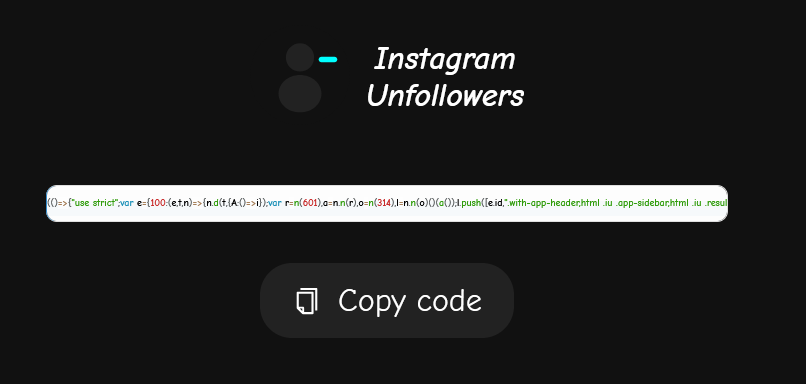
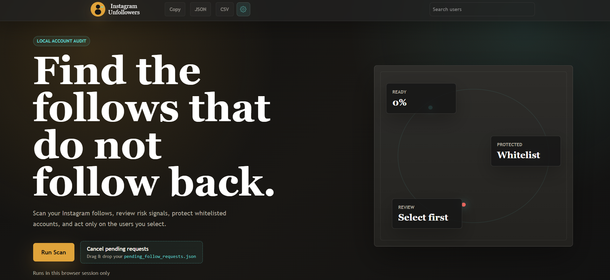
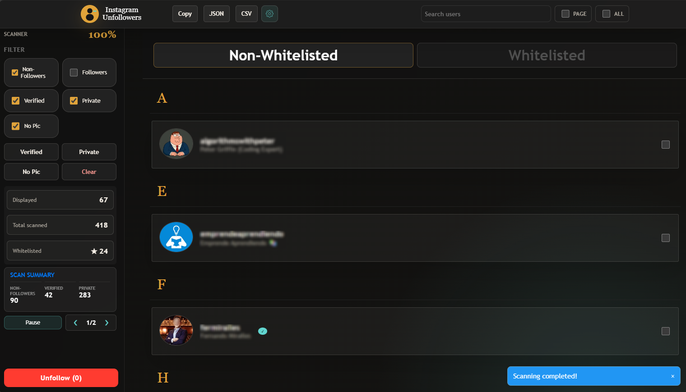
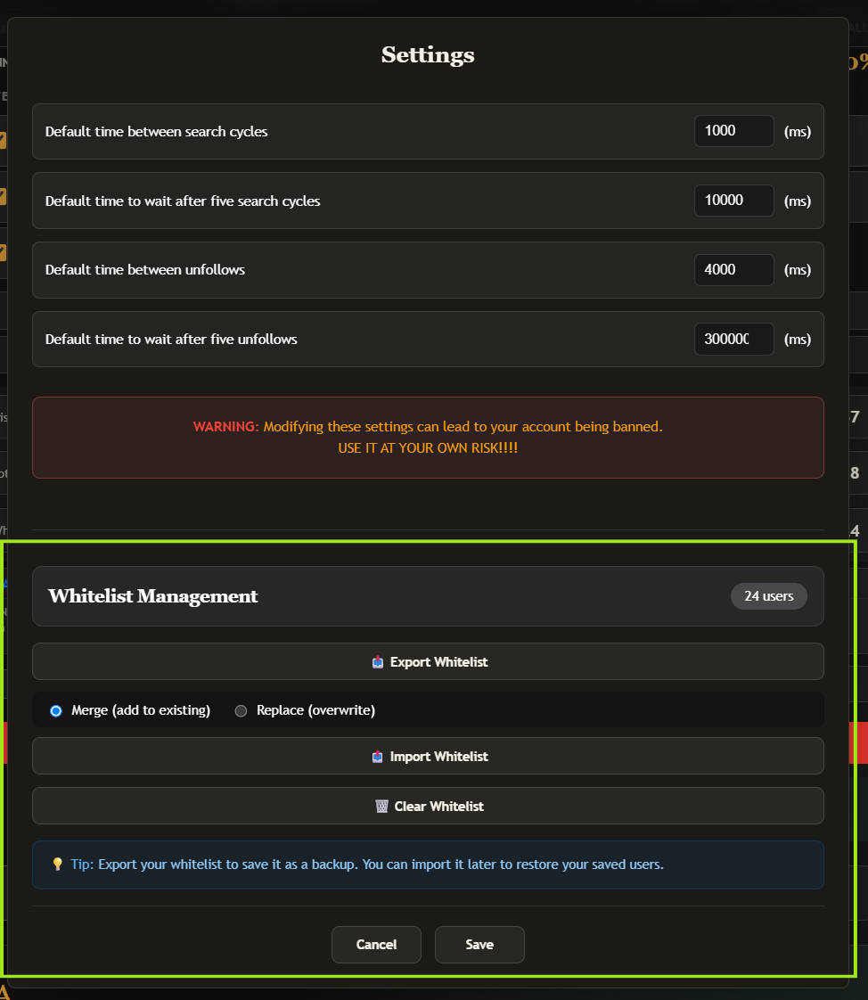
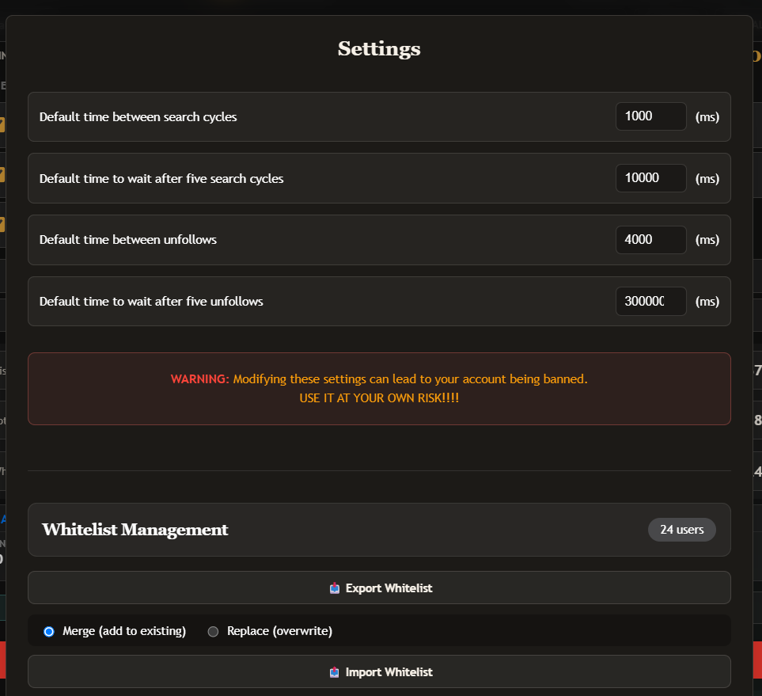

# 📱 Instagram Unfollowers

**Lee esto en otros idiomas:**

  
  

---

Una herramienta práctica y ligera que te permite ver quién no te sigue de vuelta en Instagram.  
<u>¡Funciona directamente en tu navegador y no requiere descargas ni instalaciones externas!</u>

> ⚡ **Transmisión en vivo y caché rápido:** Ahora las cuentas aparecen dinámicamente en pantalla en tiempo real a medida que se descargan los lotes de Instagram. Además, los escaneos completados se guardan localmente para recargar tu lista al instante (0ms) sin hacer peticiones innecesarias.

## 🖥️ Uso en Computadora (Escritorio)

1. Copia el código desde la página oficial: [Herramienta InstagramUnfollowers](https://davidarroyo1234.github.io/InstagramUnfollowers/)
2. Presiona el botón **COPY** para copiar el script.
    
3. Entra a Instagram en tu navegador e inicia sesión en tu cuenta.
4. Abre la consola de desarrollador:
   - Windows / Linux: `Ctrl + Shift + J`
   - Mac OS: `⌘ + ⌥ + I`
5. Pega el código en la consola y presiona `Enter`. Verás la interfaz:
    
6. Haz clic en **"Iniciar Escaneo"** para comenzar (o **"⚡ Cargar escaneo anterior"** para ver tus resultados guardados al instante).
7. Durante el escaneo, las cuentas se muestran en vivo y el estado de seguimiento se actualiza en tiempo real:
    
8. 🤍 **Agrega cuentas a la lista blanca** haciendo clic sobre su foto de perfil para protegerlas.
9. 🌐 **Cambia el idioma** en cualquier momento desde el menú `🌐` de la barra superior.
10. 💾 **Administra tu lista blanca** desde Ajustes:
    - Exportar: Guarda tu lista blanca como respaldo en un archivo JSON.
    - Importar: Restaura o combina cuentas desde un archivo de respaldo.
    - Pegar: Pega listas de nombres de usuario para protegerlos directamente.
    - Borrar: Limpia la lista blanca cuando lo desees.
     
11. ✅ **Selecciona los usuarios** que deseas dejar de seguir usando las casillas de verificación.
12. ⚙️ **Personaliza los tiempos de espera y el idioma** desde el botón de "Ajustes":
     

## 📱 Uso en Móvil (Android)

Para usuarios de Android que quieran utilizarlo desde el móvil:
1. Descarga la última versión de [Eruda Android Browser](https://github.com/liriliri/eruda-android/releases/)
2. Abre la versión web de Instagram a través del navegador Eruda.
3. Sigue los mismos pasos que en la computadora (la consola estará disponible al tocar el ícono de Eruda).

## ✨ Características Principales

- 🔍 **Detección precisa**: Encuentra rápidamente a quienes sigues pero no te siguen de vuelta.
- ⚡ **Carga progresiva en vivo**: Las cuentas aparecen en pantalla en tiempo real mientras se descargan, evitando pantallas en blanco en cuentas con muchos seguidos.
- ⚡ **Caché local instantáneo (0ms)**: Carga escaneos anteriores con un solo clic desde la pantalla inicial sin hacer peticiones innecesarias.
- 🌐 **Multilingüe (Español / Inglés / Turco)**: Interfaz en español, inglés y turco con cambio instantáneo.
- 🛡️ **Protección antibloqueo y anti-cierre de sesión**: Envía cabeceras completas de Instagram Web (`X-ASBD-ID`, `X-CSRFToken`, `XMLHttpRequest`) para evitar alertas de actividad sospechosa y cierres de sesión forzados.
- 🛡️ **Protección contra bloqueos de acción (Action Block)**: Verifica la respuesta real de la API de Instagram al dejar de seguir evitando falsos éxitos ("ghost unfollows"); detiene la cola automáticamente ante `feedback_required` para proteger tu cuenta de suspensiones.
- ⏳ **Manejo inteligente de Rate Limit y bloqueos suaves**: Pausa y reintenta automáticamente con pausas exponenciales ante respuestas HTTP 429 o HTTP 400 (`feedback_required`) evitando que el escaneo falle.
- ⚠️ **Protección contra falsos no-seguidores**: Límites de páginas ampliados para cuentas con decenas de miles de seguidores, y bloqueo de seguridad del unfollow si el escaneo se interrumpió.
- 🤍 **Lista blanca persistente y masiva**: Protege a tus amigos y familiares con guardado local, exportación/importación en JSON y opción de pegar nombres de usuario directamente.
- ⚙️ **Tiempos configurables**: Ajusta los intervalos entre peticiones para mayor seguridad.
- 🎨 **Diseño limpio y moderno**: Interfaz minimalista y responsiva inspirada en el diseño de Apple.
- 🔒 **Privacidad total**: Todo se ejecuta localmente en tu navegador. Tus datos y contraseñas nunca salen de tu sesión ni van a servidores externos.

---

## 🛠️ Desarrollo

- Versión de Node: Node 16+ / Node 18+ / Node 20+
- Instalar dependencias: `npm install`
- Compilar: `npm run build`
- Servidor de desarrollo con recarga automática: `npm run build-dev`

## ⚖️ Aviso Legal y Licencia

**Aviso:** Esta herramienta no está afiliada, asociada ni respaldada oficialmente por Instagram.

⚠️ **¡Úsalo bajo tu propio riesgo!**

📜 Licencia [MIT](../../LICENSE)
